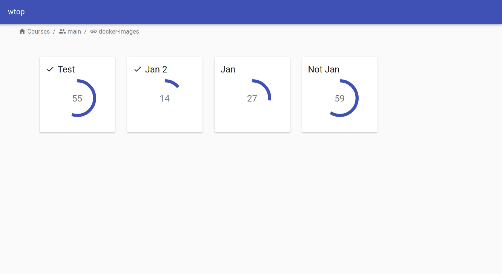
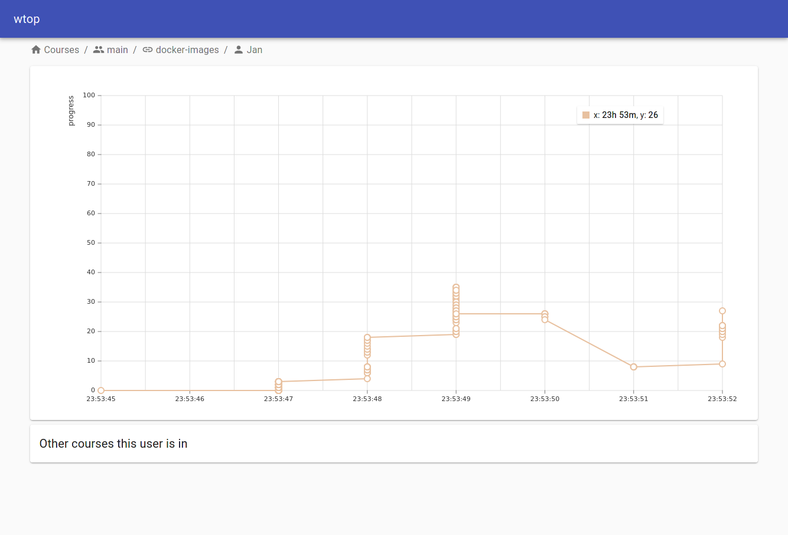

# wtop
wtop allows you to monitor the progress of users within a workshop. 
The progress is displayed to you in real-time using web sockets.

# Setup
- Clone this repository
- `$ cp .env.example .env`
- TODO
- `$ docker-compose up -d`

# Screenshots

